class: hide-count, middle, center


```{r xaringan-panelset, echo=FALSE}
xaringanExtra::use_panelset()
```

.panelset[
.panel[.panel-name[Federica Zoe Ricci]

```{r echo=FALSE, fig.align='center', out.width = "20%", fig.alt = ""}
knitr::include_graphics("figures/federica-ricci.jpeg")
```

`r fontawesome::fa(name = "link")` <a href = "https://federicazoe.github.io/">federicazoe.github.io</a>
`r fontawesome::fa(name = "github")`<a href = "http://github.com/federicazoe">federicazoe</a>  
`r fontawesome::fa(name = "envelope")` <a href = "fzricci@uci.edu">fzricci@uci.edu</a>

]

.panel[.panel-name[Catalina Mari Medina]

```{r echo=FALSE, fig.align='center', out.width = "20%", fig.alt = ""}

```

`r fontawesome::fa(name = "link")` <a href = "https://catalinamedina.github.io/">catalinamedina.github.io</a>
`r fontawesome::fa(name = "github")`<a href = "http://github.com/CatalinaMedina">CatalinaMedina</a>  
`r fontawesome::fa(name = "envelope")` <a href = "catalmm1@uci.edu">catalmm1@uci.edu</a> 

]

.panel[.panel-name[Mine Dogucu]

```{r echo=FALSE, fig.align='center', out.width = "20%", fig.alt = ""}
knitr::include_graphics("figures/mine-dogucu.jpeg")
```

`r fontawesome::fa(name = "link")` <a href = "http://minedogucu.com">minedogucu.com</a>
`r fontawesome::fa(name = "github")`<a href = "http://github.com/mdogucu">mdogucu</a>  
`r fontawesome::fa(name = "twitter")` <a href = "http://twitter.com/MineDogucu">MineDogucu</a> 
]

]

---


class: middle

## Workshop outline

- What and why?
- Example of basic grading with gradetools
- Comprehensive demo
- Resources (Q & A time)

---

class: middle

## Terminology

.emph[Grade] - Numeric score

.emph[Feedback] - Qualitative (no score)

---

class: middle

![:col_header 
<span style="font-size:23px; color:whitesmoke;">1. Preparation <br> <br> </span>
  <i class="fa-solid fa-file-arrow-down" aria-hidden="true" style="font-size:90px; color:whitesmoke;"></i>,
  <span style="font-size:23px; color:whitesmoke;">2. Grading and Feedback <br> <br> </span>
  <i class="fa-solid fa-pen-to-square" aria-hidden="true" style="font-size:90px; color:whitesmoke;"></i>,
  <span style="font-size:23px; color:whitesmoke;">3. Returning grades & feedback <br> <br> </span>
  <i class="fa-solid fa-file-arrow-up" aria-hidden="true" style="font-size:90px; color:whitesmoke;"></i>
              ]

---


class: middle center


  <span style="font-size:23px; color:whitesmoke;">2. Grading and Feedback <br> <br> </span>
  <i class="fa-solid fa-pen-to-square" aria-hidden="true" style="font-size:90px; color:whitesmoke;"></i>

--

We can think of automated grading and feedback tools as essentially long lines of if-else statements.  

---

class: middle

## Automated feedback example


`library(learnr)`

```{r echo=FALSE, fig.align='center',out.width="85%"}
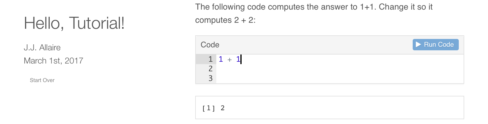
```

[Example from learnr tutorial](https://rstudio.github.io/learnr/)

---

class: middle center

  <span style="font-size:23px; color:whitesmoke;">2. Grading and Feedback <br> <br> </span>
  <i class="fa-solid fa-pen-to-square" aria-hidden="true" style="font-size:90px; color:whitesmoke;"></i>

Automated grading and feedback tools are essentially long lines of if-else statements.  

--

gradetools is NOT an automated grading or feedback tool.

---

class: middle center

gradetools is an automated grading workflow tool.

---

.pull-left[

## Tasks

- Downloading student files

]

```{r echo=FALSE, out.width="20%", fig.align='right', fig.alt="GitHub logo"}
knitr::include_graphics("figures/github-logo.png")
```

```{r echo=FALSE, out.width="20%", fig.align='right', fig.alt="Canvas logo"}
knitr::include_graphics("figures/canvas-logo.jpeg")
```

---


.pull-left2[
## Tasks
- Downloading student files

- Open each student's file(s), one by one

]

.pull-right2[
```{r echo=FALSE, out.width="180%", fig.align='right', fig.alt="A folder structure titled hw-1. There are multiple hw01 folders for different students."}
knitr::include_graphics("figures/screenshot-assignment-folders.png")
```

]

---


.pull-left2[
## Tasks
- Downloading student files

- Open each student's file(s), one by one

- Finding the corresponding student on the grade sheet.


]

.pull-right2[

<br>
<br>
```{r echo=FALSE, out.width="100%", fig.align='right', fig.alt="A screenshot of Microsoft Excel"}
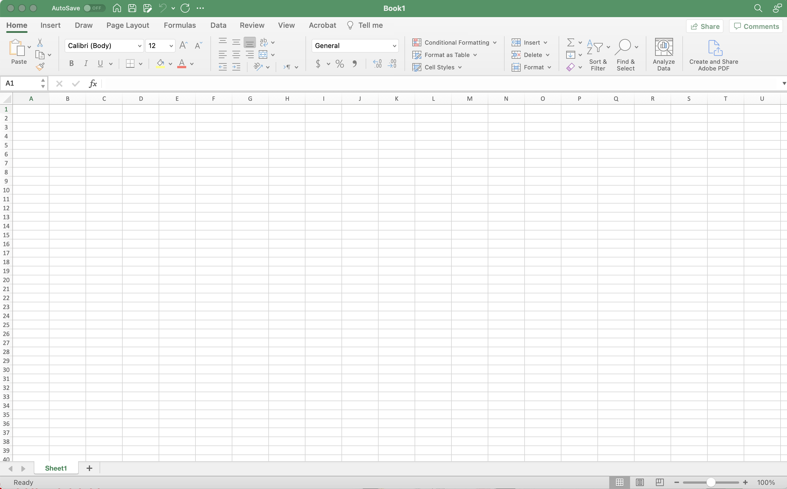
```

]

---

.pull-left2[
## Tasks
- Downloading student files

- Open each student's file(s), one by one

- Finding the corresponding student on the grade sheet.

- Evaluating student's work.


]

.pull-right2[

<br>
<br>

```{r echo=FALSE, out.width="100%", fig.align='right', fig.alt="A screenshot of Microsoft Excel"}
knitr::include_graphics("figures/rstudio-logo.png")
```

]


---

.pull-left2[
## Tasks
- Downloading student files

- Open each student's file(s), one by one

- Finding the corresponding student on the grade sheet.

- Evaluating student's work.

- Assigning a score for the work. 


]

.pull-right2[

<br>
<br>
```{r echo=FALSE, out.width="100%", fig.align='right', fig.alt="A screenshot of Microsoft Excel"}

```

]

---


.pull-left2[
## Tasks
- Downloading student files

- Open each student's file(s), one by one

- Finding the corresponding student on the grade sheet.

- Evaluating student's work.

- Assigning a score for the work. 

- Providing feedback. 

]

.pull-right2[

<br>
<br>
```{r echo=FALSE, out.width="100%", fig.align='center', fig.alt="A screenshot of Microsoft Excel"}
knitr::include_graphics("figures/rstudio-logo.png")
```

```{r echo=FALSE, out.width="40%", fig.align='center', fig.alt="A screenshot of Microsoft Excel"}
knitr::include_graphics("figures/github-logo.png")
```

```{r echo=FALSE, out.width="40%", fig.align='center', fig.alt="A screenshot of Microsoft Excel"}
knitr::include_graphics("figures/canvas-logo.jpeg")
```

]

---

class: middle

.pull-left[

## Administrative Tasks

- Opening and closing files

- Finding the corresponding student on the grade sheet

- Entering and storing grades to the gradesheet

]

.pull-right[

## Pedagogical Decisions

- Evaluating students' work
- Providing feedback
- Assigning a score

]

---

class: middle 

The gradetools package 

- .emph[automates] the repetitive .emph[administrative tasks] in the grading workflow 
- minimizes switching between different interfaces
- .emph[saves time for] more meaningful tasks that require .emph[pedagogical decisions].

---

class: middle

## Feedback Examples

| Example | Question | Student |
|---------|-----------|----------|
| "Please adhere to the Tidyverse style guide"        |  All         |   All       |
| "When interpreting the slope coefficient make sure to use units of measurement."        |  Specific        |  All        |
|  "Thank you for your note, Menglin. I am glad you had fun doing the assignment."    | All          |  Specific        |
|  "Recall our conversation about the p-value during office hour ..."    | Specific         |  Specific        |


---

class: middle

## Rubric 

| || |
|----------------|----------------------------------------------|--------------------------------------------------|
| feedback       | "Please adhere to the Tidyverse style guide" | What the student sees when they receive feedback |
| prompt_message | code style                                   | What the instructor sees while grading           |
| prompt_code    | 1                                            | What the instructor enters while grading         |

---


class: middle

## Installing our package

```{r eval=FALSE}
devtools::install_github("federicazoe/gradetools")
```


---

class: middle

## Basics of grading: demo

```{r eval = FALSE, echo = TRUE}
assist_grading(
  rubric_path = "quiz-09-lin-reg-rubric.csv", 
  roster_path = "class-roster.csv", 
  grading_progress_log_path = "quiz-09-lin-reg-grading-progress-log.csv", 
  final_grade_sheet_path = "quiz-09-lin-reg-final-grade-sheet.csv", 
  example_student_identifier = "federicazoe",
  example_assignment_path = "quizzes/quiz-09a-lin-reg-federicazoe.Rmd", 
  example_feedback_path = "quizzes/feedback-quiz-09a-lin-reg-federicazoe.html"
)
```


---

class: middle, center

<div class="row">
  <div class="column_left">
    
  </div>
  <div class="column_center">
    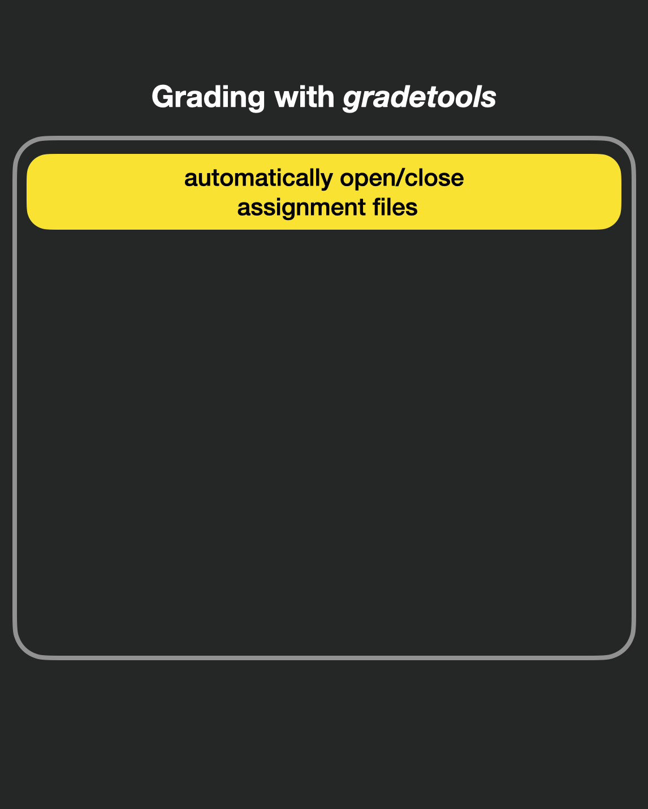
  </div>
  <div class="column_right">
    
  </div>
</div>


---

class: middle, center

<div class="row">
  <div class="column_left">
    
  </div>
  <div class="column_center">
    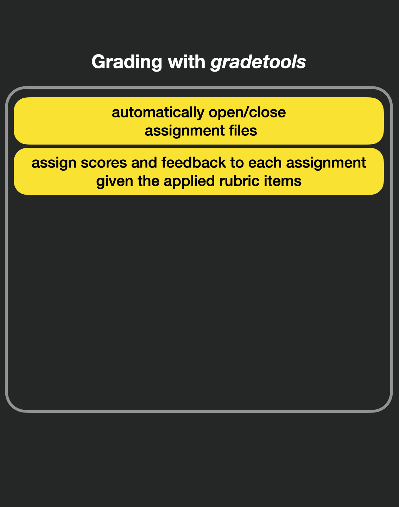
  </div>
  <div class="column_right">
    
  </div>
</div>


---

class: middle, center

<div class="row">
  <div class="column_left">
    
  </div>
  <div class="column_center">
    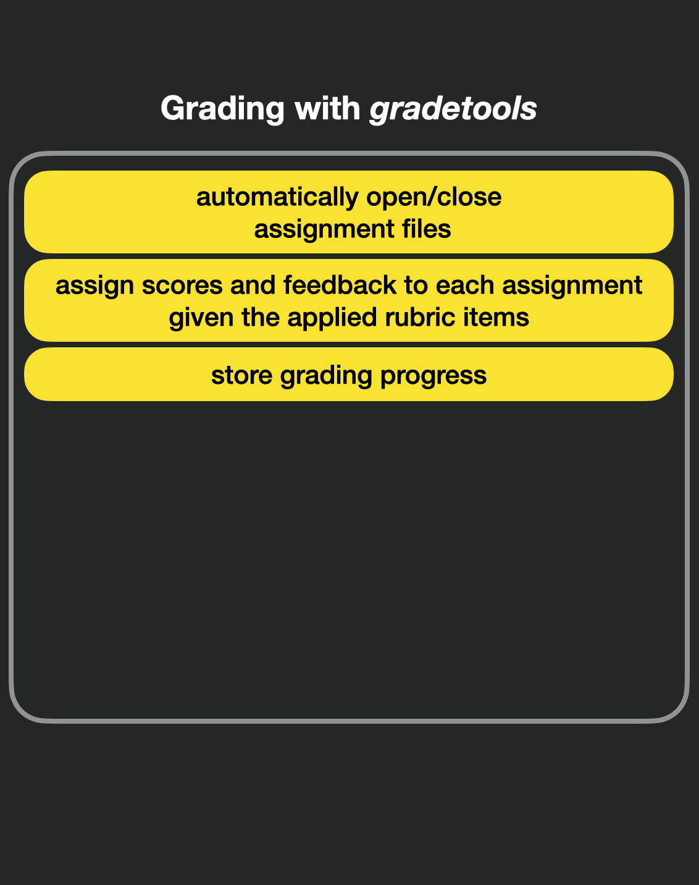
  </div>
  <div class="column_right">
    
  </div>
</div>


---

class: middle, center

<div class="row">
  <div class="column_left">
    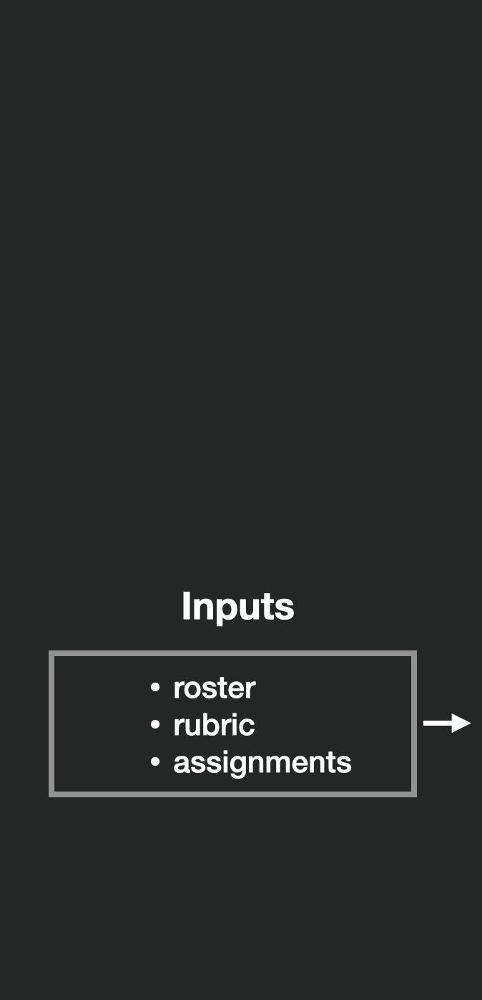
  </div>
  <div class="column_center">
    
  </div>
  <div class="column_right">
    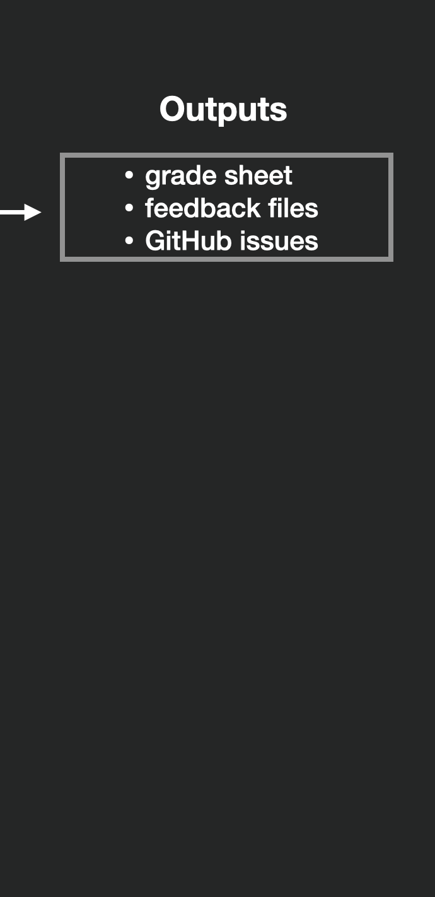
  </div>
</div>


---

class: middle, center

<div class="row">
  <div class="column_left">
    
  </div>
  <div class="column_center">
    
  </div>
  <div class="column_right">
    
  </div>
</div>

---

class: middle

## Formatting the roster  

- Must have student_identifier column

- Can be anything unique to the student, for example:  
    - Name
    - Student id
    - GitHub username

---

class: middle

## Assignment/feedback file paths  

- The student identifier must be present and the only unique part
- Provide one student identifier, assignment path(s), and feedback path 

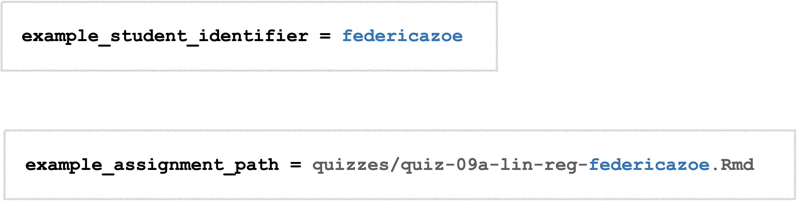

---

class: middle, center

## Example assignment directories

<div class="row">
  <div class="column_half_left">
    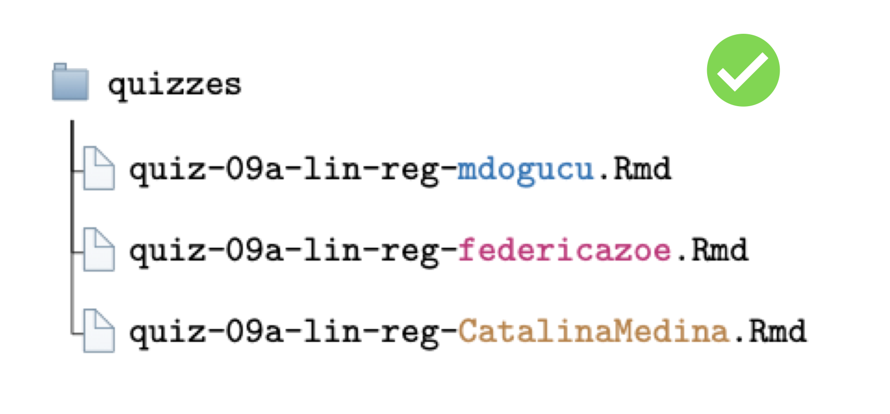
  </div>
  <div class="column_half_right">
    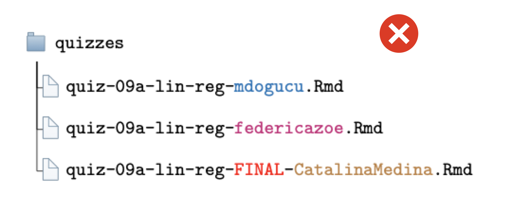
  </div>
</div>

---

class: middle, center

## Example assignment directories

<div class="row">
  <div class="column_half_left">
    
  </div>
  <div class="column_half_right">
    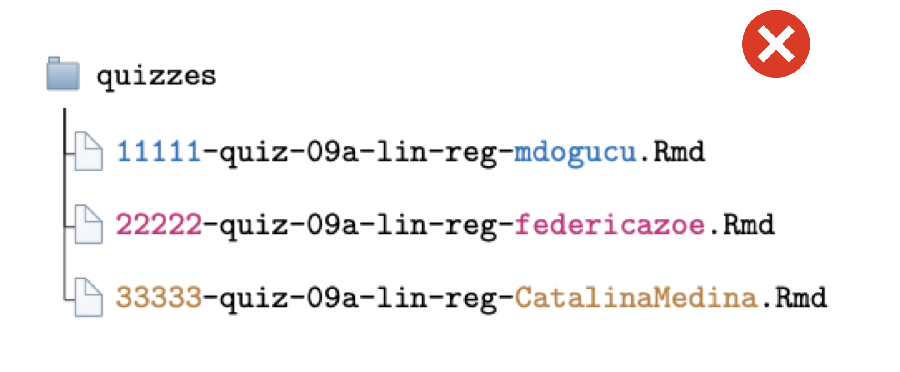
  </div>
</div>

---

class: middle, center


## Three example arguments

```{r, eval = FALSE}
example_student_identifier = "federicazoe"
example_assignment_path = "quizzes/quiz-09a-lin-reg-federicazoe.Rmd"
example_feedback_path = "quizzes/feedback-federicazoe.html"
```


---

class: hide-count, middle

.pull-left[
### Feedback extensions:

- Rmd
- md (for GitHub documents)
- docx (for Word documents)
- html
- pdf

]

--

.pull-right[
### Assignment extensions:


- Anything that opens in Rstudio using `navigateToFile()`

]

---

class: middle, center

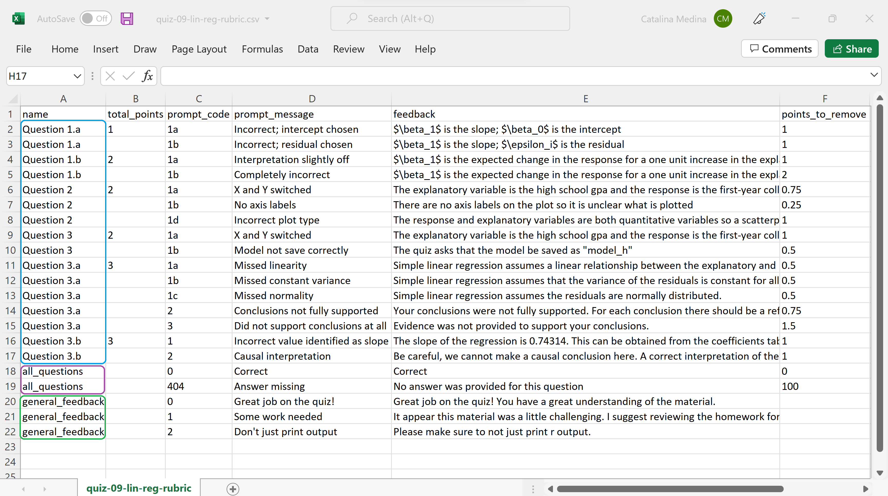

---

class: hide-count, middle

.pull-left[
### Rubric column headers:

- name
- total_points
- prompt_code (entered by user)
- prompt_message (displayed to user)
- feedback (displayed to student)
- points_to_remove or points_to_add

]

--

.pull-right[
### Rubric item types:

- question/component
- all_questions
- general_feedback

]

---

class: middle

## Review of `assist_grading()` arguments 

```{r eval = FALSE, echo = TRUE}
assist_grading(
  rubric_path = "quiz-09-lin-reg-rubric.csv", 
  roster_path = "class-roster.csv", 
  grading_progress_log_path = "quiz-09-lin-reg-grading-progress-log.csv", 
  final_grade_sheet_path = "quiz-09-lin-reg-final-grade-sheet.csv", 
  example_student_identifier = "federicazoe",
  example_assignment_path = "quizzes/quiz-09a-lin-reg-federicazoe.Rmd", 
  example_feedback_path = "quizzes/feedback-quiz-09a-lin-reg-federicazoe.html"
)
```

---

class: middle, center

<div class="row">
  <div class="column_left">
    
  </div>
  <div class="column_center">
    
  </div>
  <div class="column_right">
    
  </div>
</div>

---

class: middle, center

<div class="row">
  <div class="column_left">
    
  </div>
  <div class="column_center">
    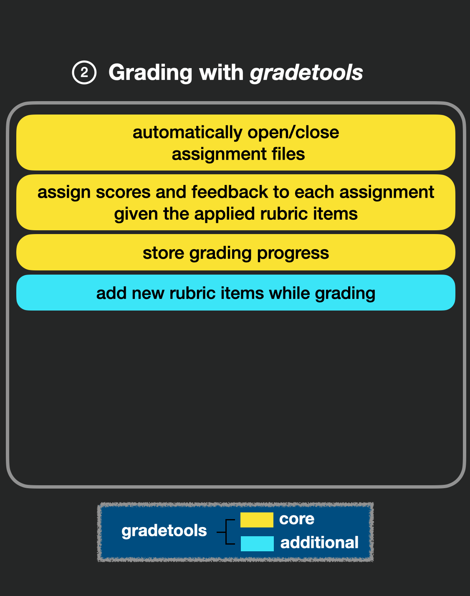
  </div>
  <div class="column_right">
    
  </div>
</div>

---

class: middle, center

<div class="row">
  <div class="column_left">
    
  </div>
  <div class="column_center">
    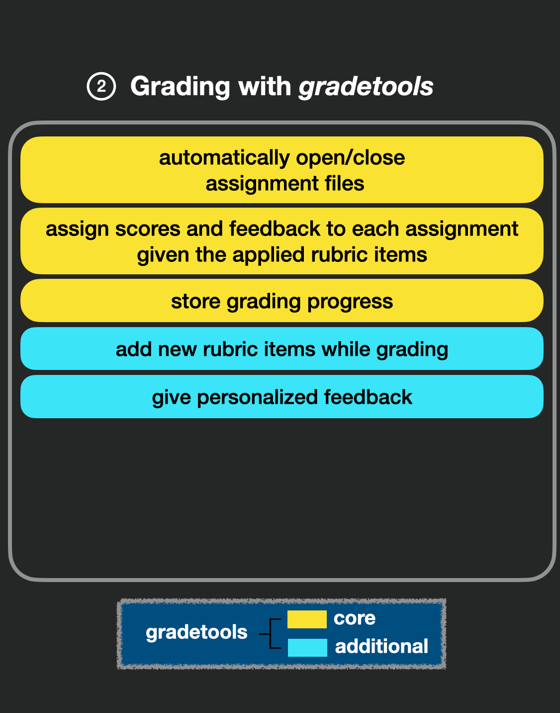
  </div>
  <div class="column_right">
    
  </div>
</div>

---

class: middle, center

<div class="row">
  <div class="column_left">
    
  </div>
  <div class="column_center">
    
  </div>
  <div class="column_right">
    
  </div>
</div>

---

class: middle, center

<div class="row">
  <div class="column_left">
    
  </div>
  <div class="column_center">
    
  </div>
  <div class="column_right">
    
  </div>
</div>

---

class: middle, center

<div class="row">
  <div class="column_left">
    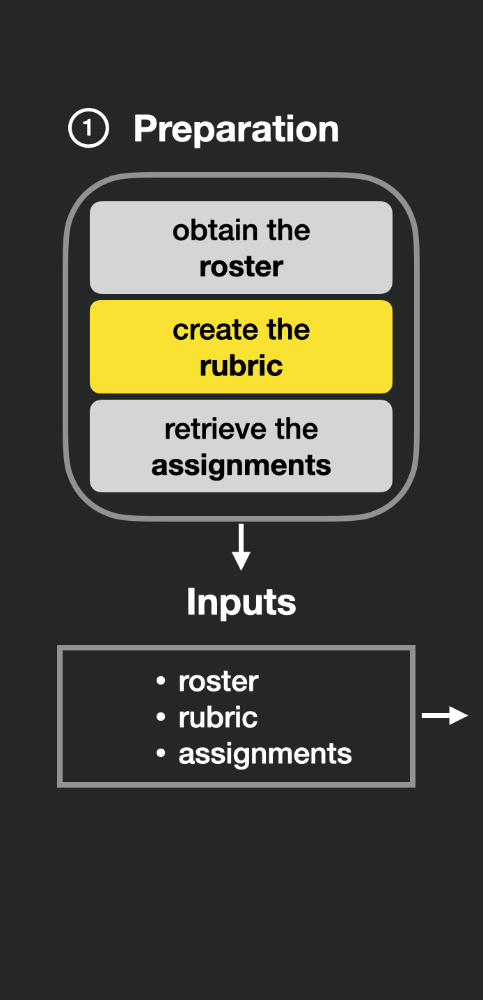
  </div>
  <div class="column_center">
    
  </div>
  <div class="column_right">
    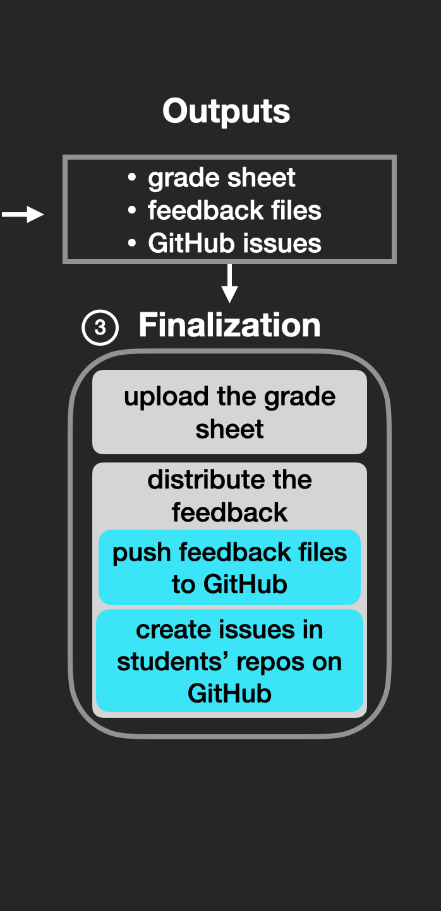
  </div>
</div>


---


class: middle

## Assist grading functions

|                           | Specify student and question to grade               | GitHub                                              | Team                                                |
|---------------------------|-----------------------------------------------------|-----------------------------------------------------|-----------------------------------------------------|
| .code[assist_grading()]          | `r fontawesome::fa(name = "times", fill = "red")`   | `r fontawesome::fa(name = "times", fill = "red")`   | `r fontawesome::fa(name = "times", fill = "red")`   |
| .code[assist_advanced_grading()] | `r fontawesome::fa(name = "check", fill = "green")` | `r fontawesome::fa(name = "check", fill = "green")` | `r fontawesome::fa(name = "times", fill = "red")`   |
| .code[assist_team_grading()]     | `r fontawesome::fa(name = "check", fill = "green")` | `r fontawesome::fa(name = "check", fill = "green")` | `r fontawesome::fa(name = "check", fill = "green")` |


---


class: middle

## Comprehensive demo...

--

```{r eval = FALSE, echo = TRUE}
assist_team_grading(
  rubric_path = "rubric.csv",
  roster_path = "roster.csv",
  grading_progress_log_path  = "grading_progress_log.csv",
  final_grade_sheet_path = "final-grade-sheet.csv",
  example_assignment_path = c(
    "final-project-team-repos/final-project-team-gamma/README.md",
    "final-project-team-repos/final-project-team-gamma/proposal/proposal.md",
    "final-project-team-repos/final-project-team-gamma/presentation/presentation.Rmd"
  ) ,
  example_feedback_path = "final-project-team-repos/final-project-team-gamma/feedback.md",
  example_team_identifier = "gamma",
  github_issues = TRUE
)
```

---

## Push feedback and issues

```{r eval = FALSE, echo = TRUE}
push_to_github(
  grading_progress_log_path = "grading_progress_log.csv",
  class_github_name = "gradetools-test-course",
  example_identifier = "gamma",
  example_github_repo = "final-project-team-gamma",
  push_feedback = TRUE,
  create_issues = TRUE,
  team_grading = TRUE
)

```

---

## Re-grade 

```{r eval = FALSE, echo = TRUE}
assist_regrading(
  rubric_path = "rubric.csv",
  grading_progress_log_path = "grading_progress_log.csv",
  final_grade_sheet_path = "final-grade-sheet.csv",
  questions_to_regrade = c("Proposal"),
  students_to_regrade = NULL,
  teams_to_regrade = c("gamma"),
  github_issues = TRUE
)
```

---

class: middle, center

<div class="row">
  <div class="column_left">
    
  </div>
  <div class="column_center">
    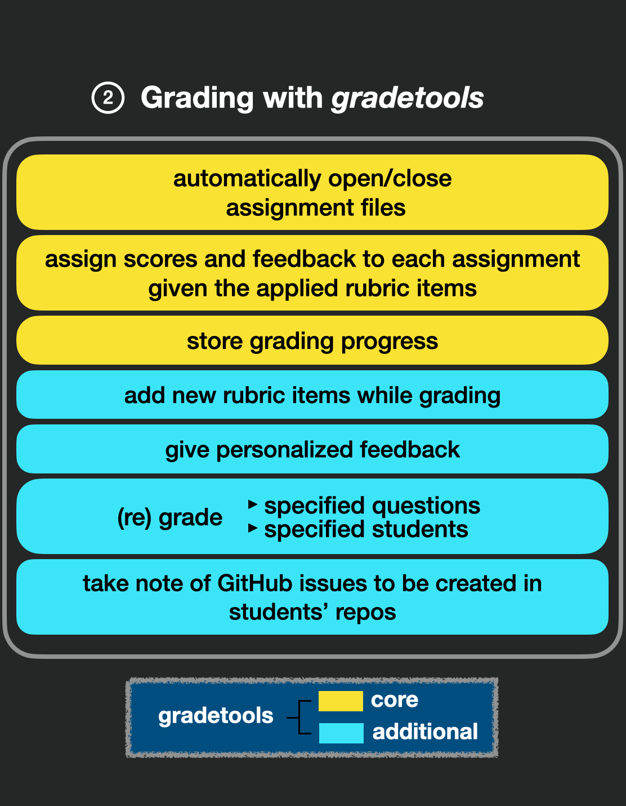
  </div>
  <div class="column_right">
    
  </div>
</div>


---

class: middle center

## Acknowledgements


```{r echo=FALSE, fig.alt="NSF logo", out.width = "10%", fig.align="center"}
knitr::include_graphics("figures/nsf-logo.png")
```

NSF HDR DSC award \#2123366 

```{r echo=FALSE, fig.alt="Hasso Plattner Institute in Machine Learning and Data Science logo", out.width = "20%", fig.align="center"}

```

HPI

---

class: middle 

## RESOURCES

https://github.com/federicazoe/gradetools

https://federicazoe.github.io/gradetools/articles/

- [How to grade with gradetools](https://federicazoe.github.io/gradetools/articles/a-grading-with-gradetools.html)
- [How to regrade assignments with gradetools](https://federicazoe.github.io/gradetools/articles/b-regrading-with-gradetools.html)
- [Extended gradetools capability: Team Grading](https://federicazoe.github.io/gradetools/articles/c-extended-capability-teams.html)
- [Extended gradetools capability: Assignments on GitHub](https://federicazoe.github.io/gradetools/articles/d-extended-capability-github.html)
- [Comprehensive example of grading with gradetools](https://federicazoe.github.io/gradetools/articles/e-comprehensive-example.html)

<!-- mention CRAN-->

---

class: middle

Thank you

<hr>

Questions?

<hr>


`r fontawesome::fa(name = "link")` <a href = "federicazoe.github.io/gradetools-RoSE/">federicazoe.github.io/gradetools-RoSE/</a>


